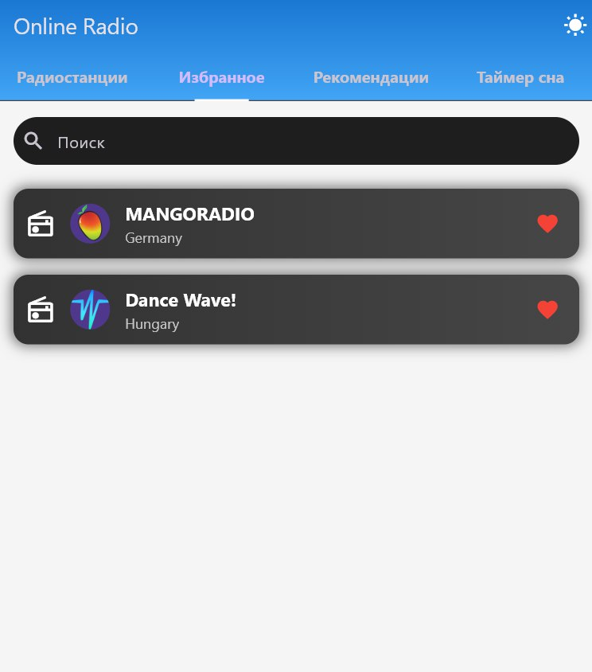

# Avrora_Radio 📻
Avrora_Radio — лучшее приложение для онлайн прослушивания ваших любимых радиостанций. Наслаждайтесь любимой музыкой различных жаноровв любое время и в любом месте!

## Возможности 🕶️

🎧**Таймер сна**: установите таймер, чтобы радио автоматически отключалось через заданное время. После истечения установленного времени, радио выключается, происходит переход на экран "Радиостанции".

📒**Сортировка радиостанций**: удобная сортировка по жанрам и алфавиту для быстрого поиска нужной станции.

🔍**Поиск по названию**: легко находите радиостанции по их названию.

⭐**Избранные радиостанции**: добавляйте радиостанции в список избранных для быстрого доступа.

## Интерфейс 💥
Приложение имеет строгий и лаконичный интерфейс, который делает управление простым и интуитивно понятным. Вы сможете сосредоточиться на прослушивании, не отвлекаясь на сложные настройки.

## Галерея 📷
<h3>Изображения</h3>

  
  
  

