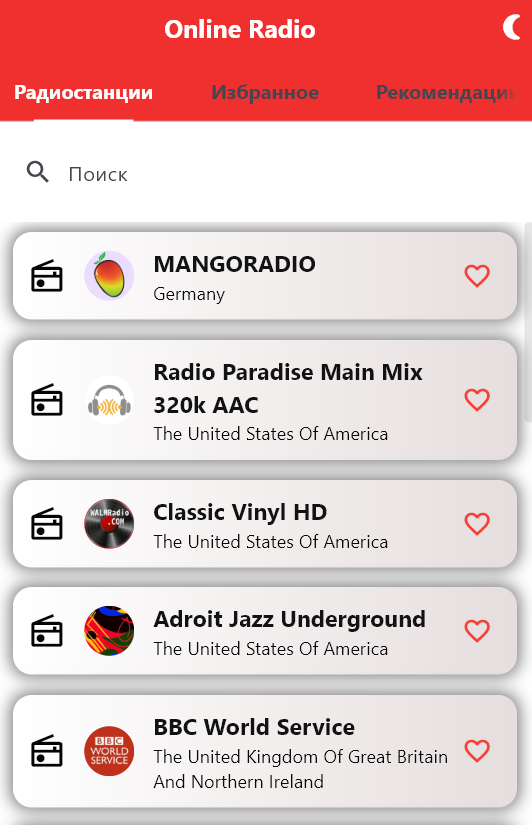
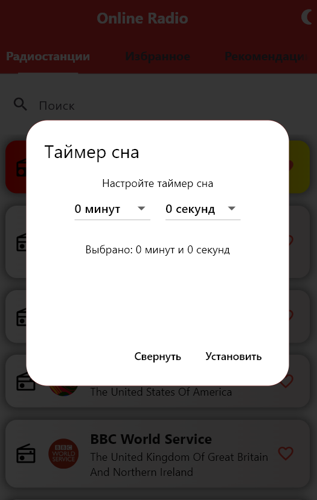
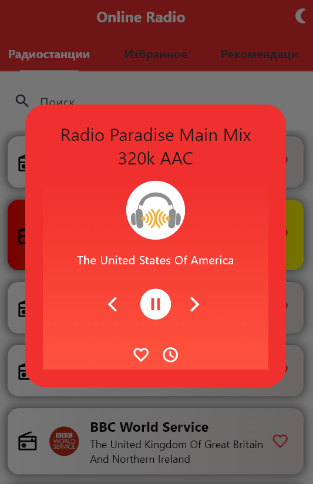
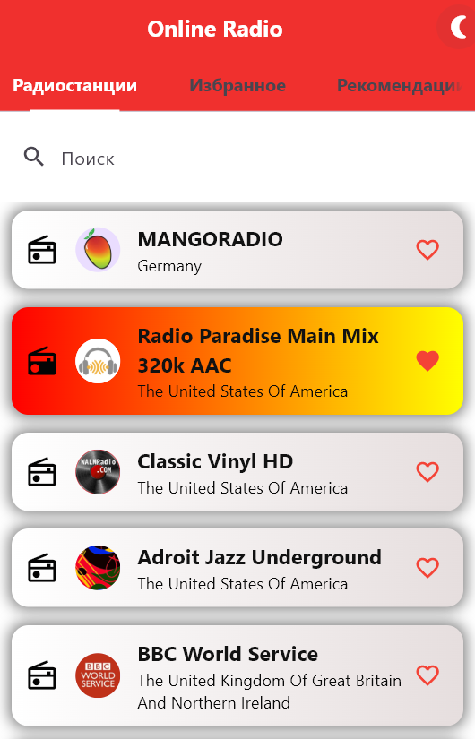
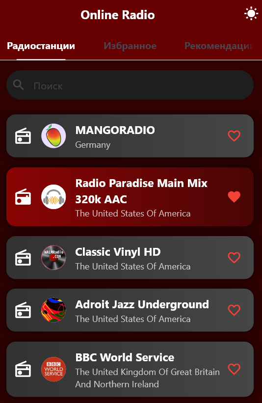
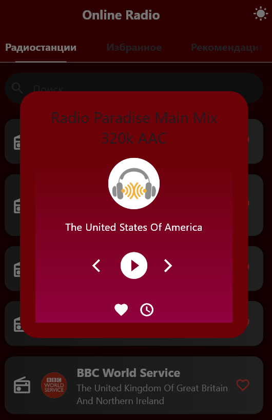

# Avrora_Radio 📻
Avrora_Radio — лучшее приложение для онлайн прослушивания ваших любимых радиостанций. Наслаждайтесь любимой музыкой различных жаноровв любое время и в любом месте!

## Функциональность 🕶️

🎧**Таймер сна**: установите таймер, чтобы радио автоматически отключалось через заданное время. После истечения установленного времени, радио выключается, происходит переход на экран "Радиостанции".

📒**Темный режим**: режим отображения интерфейса, который использует темные цвета для фона и светлые для текста и элементов управления. Этот режим может помочь снизить нагрузку на глаза, особенно в условиях низкой освещенности, а также может сэкономить заряд батареи.

🔍**Поиск по названию**: легко находите радиостанции по их названию.

⭐**Избранные радиостанции**: добавляйте радиостанции в список избранных для быстрого доступа.

## Интерфейс 💥
Приложение имеет строгий и лаконичный интерфейс, который делает управление простым и интуитивно понятным. Вы сможете сосредоточиться на прослушивании, не отвлекаясь на сложные настройки.
В правом верхнем углу экрана расположена кнопка в виде 

## Разработка 🔧

* **Flutter** - фреймворк для создания кроссплатформенных приложений.
* **Dart** - язык программирования, используемый для разработки приложения.
* **HTTP** - для работы с API радиостанций.
* **Avrora PSDK** - набор инструментов для разработки, отладки и тестирования компонентов операционной системы Аврора. Включает в себя средства для сборки приложений и работы с различными архитектурами процессоров. Аврора PSDK предоставляет разработчикам возможность создавать программное обеспечение для платформы Аврора, используя различные языки программирования и фреймворки. 

### Используемые библиотеки 📚
* **material.dart** - предоставляет виджеты и инструменты для создания приложений с использованием Material Design — визуального языка, разработанного Google. С помощью этой библиотеки вы можете использовать такие элементы, как кнопки, текстовые поля, карточки и другие компоненты интерфейса.
* **audioplayers** - позволяет воспроизводить аудиофайлы в приложении. С помощью этого пакета вы можете управлять воспроизведением аудио, включая функции, такие как воспроизведение, пауза, остановка и управление громкостью.
* **http** - предоставляет функции для выполнения HTTP-запросов. С помощью этого пакета вы можете отправлять запросы к веб-серверам, получать данные и обрабатывать ответы. Использование as http позволяет вам использовать префикс http для обращения к функциям этого пакета, что помогает избежать конфликтов имен с другими библиотеками.
* **dart:convert** - предоставляет функции для кодирования и декодирования данных в различных форматах, таких как JSON. Это полезно, когда вы работаете с API, которые возвращают данные в формате JSON, так как вы можете легко преобразовать эти данные в объекты Dart и обратно.
* **dart:async** - предоставляет классы и функции для работы с асинхронным программированием. Она включает в себя такие элементы, как Future и Stream, которые позволяют вам обрабатывать асинхронные операции, такие как ожидание завершения HTTP-запросов или обработки событий.
* **dart:math** - предоставляет математические функции и константы. Вы можете использовать её для выполнения различных математических операций, таких как генерация случайных чисел, работа с тригонометрическими функциями и т.д.
* **services.dart** - предоставляет доступ к различным службам платформы, таким как управление состоянием системы, работа с буфером обмена, управление текстовыми полями и другие функции, специфичные для платформы. Это может быть полезно, если вам нужно взаимодействовать с нативными функциями устройства.

## Галерея 📷
<h3>Изображения</h3>

<p float="left">
  
  
  
  
  
  
  
</p>

## Обратная связь 📞 
Если у вас есть вопросы или предложения, вы можете обратиться:

* Email: andrey2001maslov@gmail.com

## Установка 🚀 

Чтобы запустить проект на своем устройстве, выполните следующие шаги:

1. Клонируйте репозиторий:

   ```bash
  git clone https://github.com/andmas898/AVRORA_RADIO/edit/main/README.md
   
2. Перейдите в директорию проекта:

    ```bash
   cd radio
   
4. Установите зависимости:
 
 ```bash
  flutter pub get

4. Запустите приложение:

 ```bash
  flutter run
